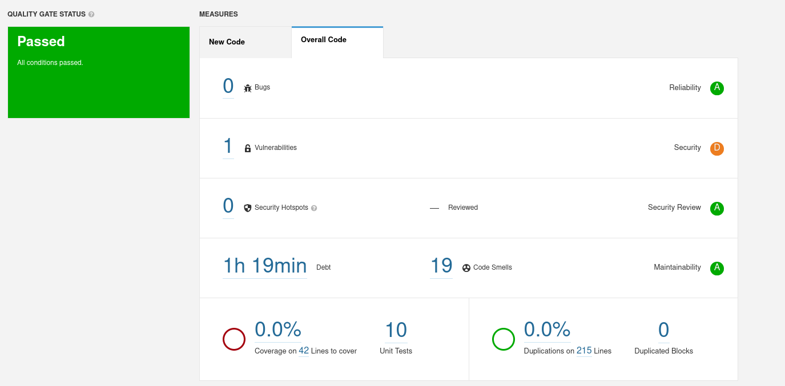

## a)

Technical debt is the amount of effort needed to increase the quality of the code and its estimate time

## b) 

After correcting the severe code smells, the coverage of the tests is 53.2%, there are 50 lines and 2 conditions that are not covered (CarController). Considering only the new code, the coverage is 66.67%, there are 13 lines and 2 conditions not covered (CarController).